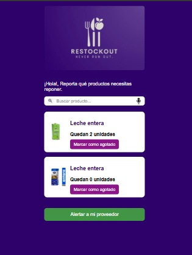
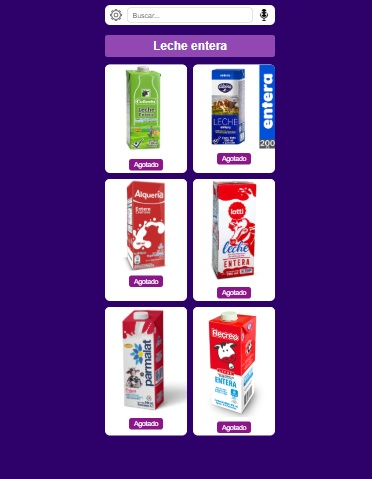

# RestockOut 📦

App de gestión de inventario para productos agotados, desarrollada como parte de mi formación en el SENA.

## 🚀 Funcionalidades

- Registro e inicio de sesión
- Gestión de productos agotados
- Panel de control para seguimiento

## 🛠️ Tecnologías usadas

- HTML, CSS
- JavaScript
- Firebase (Auth y DB)
- Figma (Diseño UI)

## Vista previa de la aplicación

### Página de Inicio

### Dashboard

### Productos Agotados

## 👨‍💻 Autor

Sergy Ferreira – [GitHub](https://github.com/Sergy-octane)
