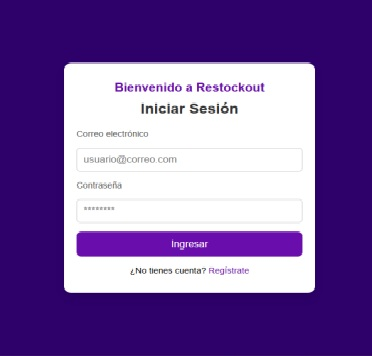

# RestockOut 📦

App de gestión de inventario para productos agotados, desarrollada como parte de mi formación en el SENA.

## 🚀 Funcionalidades

- Registro e inicio de sesión
- Gestión de productos agotados
- Panel de control para seguimiento

## 🛠️ Tecnologías usadas

- HTML, CSS
- JavaScript
- Firebase (Auth y DB)
- Figma (Diseño UI)

## Vista previa de la aplicación

### Página de Inicio

### Dashboard

### Productos Agotados

## 👨‍💻 Autor
## Recursos Audiovisuales

El prototipo utiliza imágenes únicamente con fines educativos y de demostración para la evidencia de aprendizaje. No representan material propio ni comercial.

### Imágenes utilizadas:
- Icono de búsqueda (Buscar.jpg): Imagen genérica utilizada como icono de lupa.
- Icono de micrófono (Microfono.png): Imagen genérica utilizada como icono representativo de audio.
- Icono de configuración (Config.png): Imagen genérica para ajustes.
- Logo (Logo.jpg): Logo temporal utilizado únicamente para fines educativos.
- Producto1.jpg - Producto6.jpg: Imágenes genéricas de productos del supermercado obtenidas como material de ejemplo.

### Créditos visuales:
Todas las imágenes se utilizan con fines académicos, sin intención comercial.
Estas imágenes son ejemplos genéricos provenientes de fuentes libres o creadas únicamente para la simulación del prototipo.

Sergy Ferreira – [GitHub](https://github.com/Sergy-octane) con Ruben Acosta y alejandra Cano
